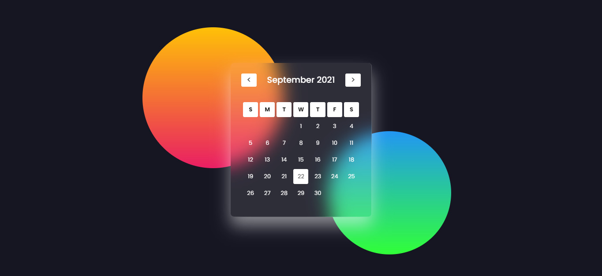

<h1 align="center"> Calendar Dynamic Javascript </h1>

<h1 align="center">
    
</h1>

 <a href="#-tecnologias">Tecnologias</a> 

## 💻 Sobre o projeto

Projeto Front-End de um Calendario dinamico usando JS

## 🛠 Tecnologias

As seguintes ferramentas foram usadas na construção do projeto:

#### **Layout**

- **[HTML](https://www.w3schools.com/html/)**
- **[CSS](https://www.w3schools.com/css/)**
- **[Js](https://www.w3schools.com/w3js/)**

#### **Utilitários**

- Api  **[Calendario JS](https://github.com/yusufshakeel/dyCalendarJS)**
- Editor **[Visual Studio Code](https://code.visualstudio.com/)**
- Markdown **[StackEdit](https://stackedit.io/)**, **[Markdown Emoji](https://gist.github.com/rxaviers/7360908)**
